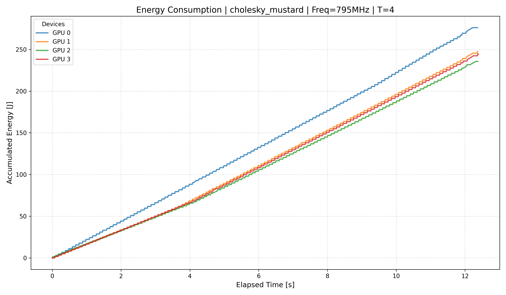
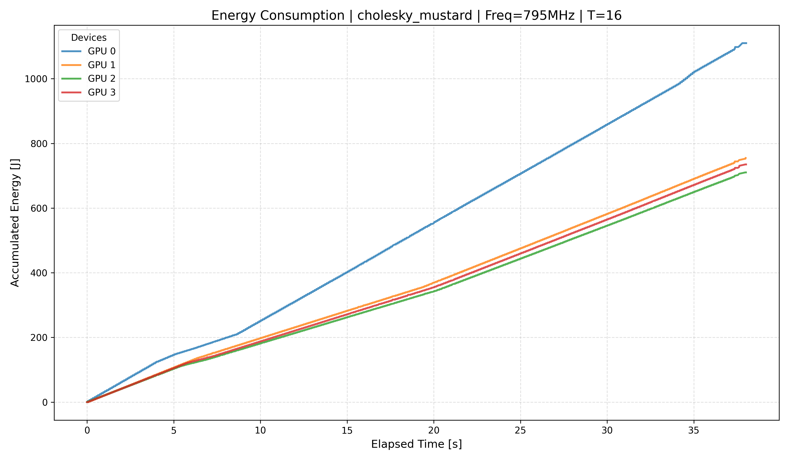
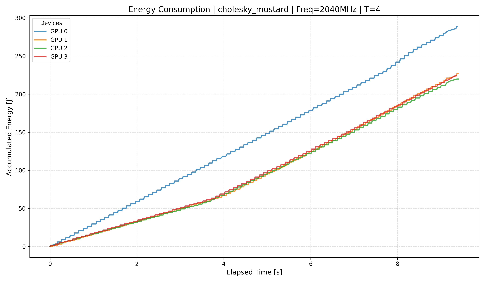
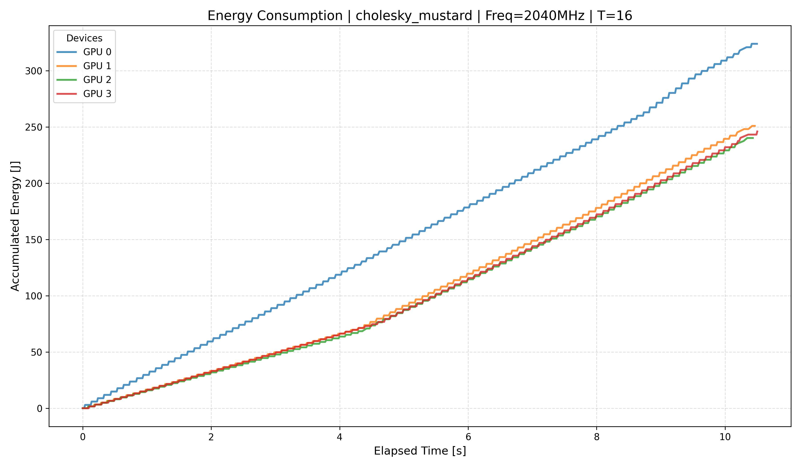
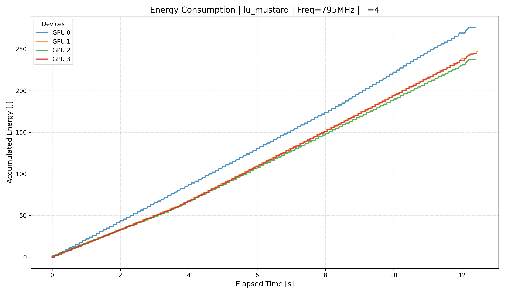
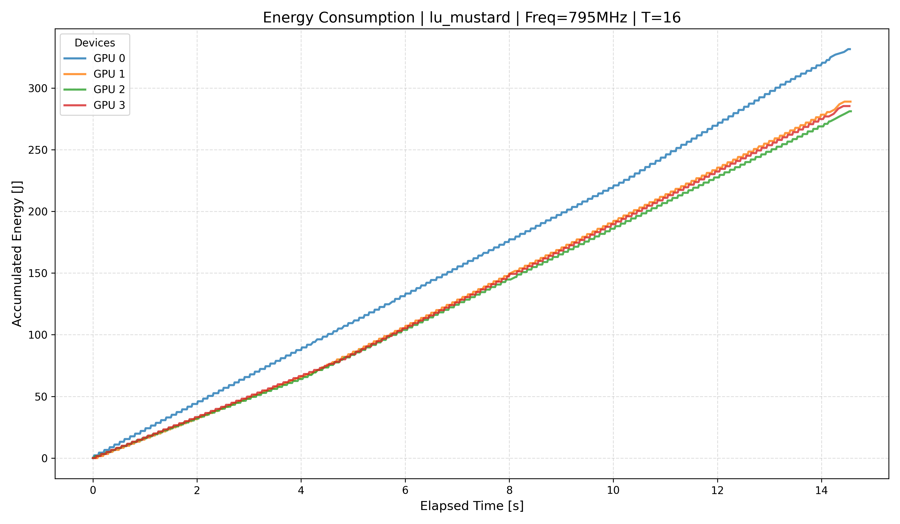
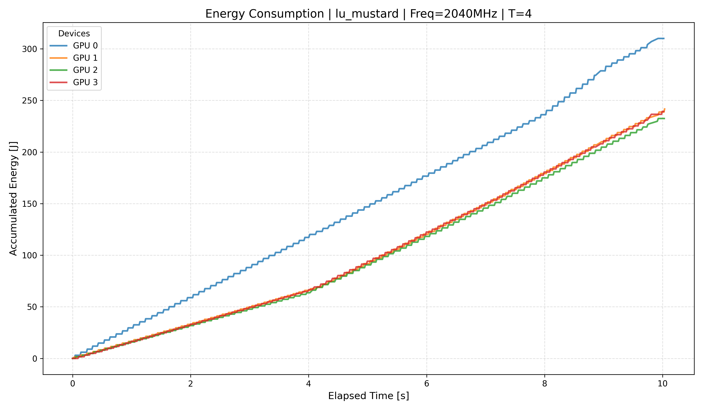
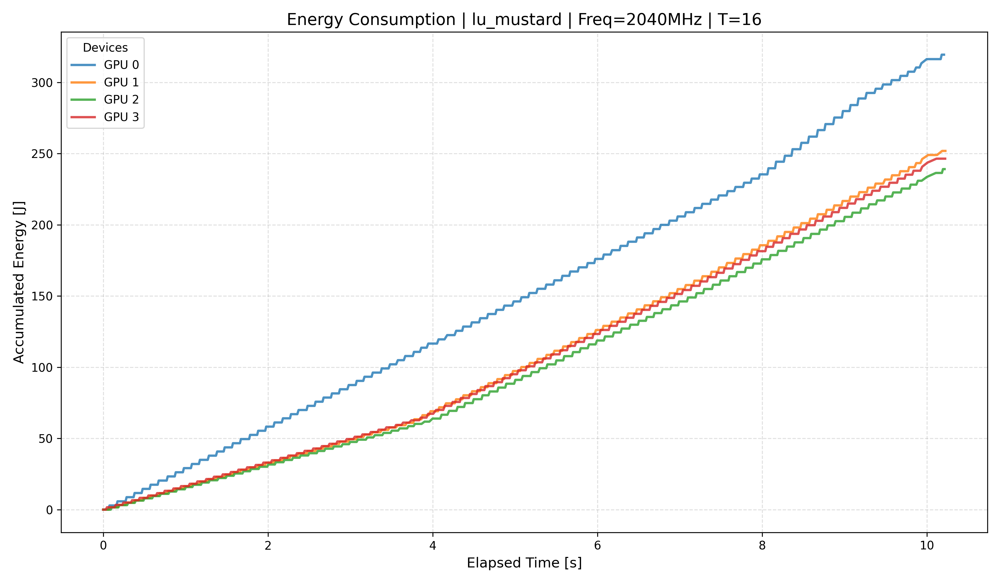
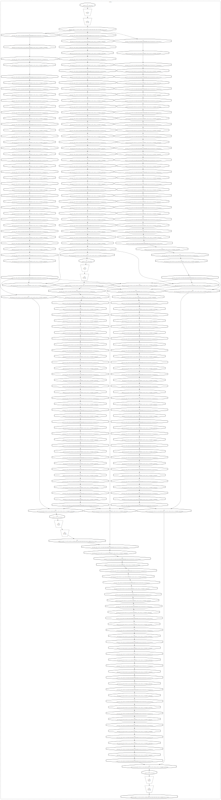
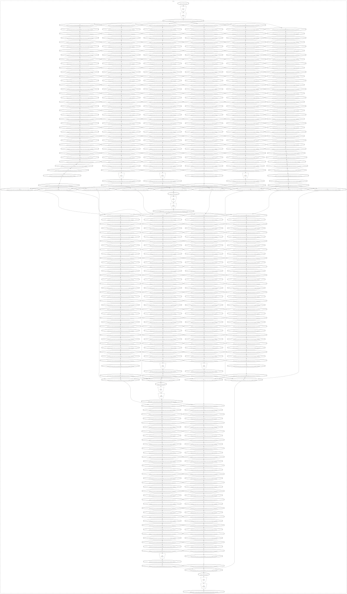

# dvfs_thesis

## results tuesday 24

### Energy comparisons

 
 
 
 
 
  

Which observations do we make?

GPU0 have higher power usage than the other GPUS

The other GPUS have almost identical power draw

Which conclusions can be drawn?

GPU0 is doing the most work

Questions:

The time calculation is most likely inaccurate, however, how should I measure the time it takes to run the benchmark?

### Dags

#### cholesky t4
 
#### cholesky t16
 
#### lu t4
 
#### lu t16


In the initial version of baseline experiments, gpu usage looked perfectly distributed. The graphs do show a relationship between tasks which makes that improbable, this is further reinforced from looking at the current baseline graphs.

The plots for 3/4 gpus do still look suspicously similar, potential cause is lag between starting profiler and program. Also the timer in the program shows times that are 1-2 orders of magnitude of the amount of time profiled, which needs looking in to.

# friday 16th april

```
(venv_hpc) sargent@minerva:~/dvfs_thesis/result-processing$ python theoretical_edp.py 
bench                      freq_mhz  median_time_s  mean_time_s  total_energy_mj          edp
------------------------------------------------------------------------------------------
lu_mustard                     2040         1.1764       1.1776       168866.000     198.6510
lu_mustard                     1815         1.4580       1.4839       180093.000     262.5767
lu_mustard                     1740         1.2107       1.5321       148014.000     179.1976
lu_mustard                     1665         1.1799       1.1780       144963.000     171.0476
lu_mustard                     1590         1.1918       1.1890       141222.000     168.3111
lu_mustard                     1515         1.8905       1.6653       198297.000     374.8834
lu_mustard                     1440         1.9596       1.7224       205510.000     402.7167
lu_mustard                     1365         1.3819       1.5522       139343.000     192.5595
lu_mustard                     1290         1.2626       1.2616       136896.000     172.8440
lu_mustard                     1215         1.2726       1.2790       133774.000     170.2441
lu_mustard                     1140         1.8011       1.7212       175579.000     316.2379
lu_mustard                     1065         1.3534       1.6051       129045.000     174.6529
lu_mustard                      990         1.6949       1.7354       162691.000     275.7427
lu_mustard                      915         1.4649       1.4756       135686.000     198.7599
lu_mustard                      840         1.5330       1.6942       143629.000     220.1841
lu_mustard                      765         1.5940       1.5879       151830.000     242.0184
lu_mustard                      690         1.9251       2.0266       175813.000     338.4616
lu_mustard                      615         1.9578       1.9667       179337.000     351.1025
lu_mustard                      540         2.2609       2.3711       205509.000     464.6306
lu_mustard                      465         2.6077       2.5984       230986.000     602.3345
lu_mustard                      390         3.0521       3.0730       271598.000     828.9453
lu_mustard                      315         3.7930       3.8032       327712.000    1243.0154
lu_mustard                      240         4.8714       4.8358       406757.000    1981.4908
cholesky_mustard               2040         0.9155       0.9331       120830.000     110.6156
cholesky_mustard               1815         0.8295       0.8285        98984.000      82.1080
cholesky_mustard               1740         0.6161       0.6117        74667.000      46.0013
cholesky_mustard               1665         0.6189       0.6200        72657.000      44.9650
cholesky_mustard               1590         0.9176       0.9057       100193.000      91.9334
cholesky_mustard               1515         0.6202       0.6212        68484.000      42.4734
cholesky_mustard               1440         0.9843       1.0038       104908.000     103.2581
cholesky_mustard               1365         1.0155       0.9731       102217.000     103.8019
cholesky_mustard               1290         0.6512       0.6508        62995.000      41.0212
cholesky_mustard               1215         0.6710       0.8042        68913.000      46.2402
cholesky_mustard               1140         0.6710       0.6708        69946.000      46.9366
cholesky_mustard               1065         0.6756       0.6729        69106.000      46.6909
cholesky_mustard                990         1.0469       1.0375       102885.000     107.7124
cholesky_mustard                915         0.7183       0.7707        67998.000      48.8417
cholesky_mustard                840         0.9386       0.9455        91279.000      85.6757
cholesky_mustard                765         0.9697       0.9810        84130.000      81.5825
cholesky_mustard                690         0.8336       0.8320        81799.000      68.1855
cholesky_mustard                615         0.9504       0.9820        92113.000      87.5477
cholesky_mustard                540         1.0476       1.1238        99771.000     104.5155
cholesky_mustard                465         1.2084       1.2165       107484.000     129.8827
cholesky_mustard                390         1.4341       1.4606       123548.000     177.1808
cholesky_mustard                315         1.7663       1.7622       155552.000     274.7567
cholesky_mustard                240         2.3139       2.3195       195331.000     451.9690

Parsed 46 experiments.

Benchmark                 Metric    Best freq (MHz)          Value   vs 2040MHz    vs 240MHz
--------------------------------------------------------------------------------
cholesky_mustard          edp                  1290        41.0212       269.7%      1101.8%
cholesky_mustard          e2dp                 1290      2584.1309       517.2%      3416.4%
cholesky_mustard          e3dp                 1290    162787.3246       992.1%     10593.3%
cholesky_mustard          ed2p                 1515        26.3417       384.4%      3970.1%
cholesky_mustard          ed3p                 1515        16.3370       567.5%     14811.9%
lu_mustard                edp                  1590       168.3111       118.0%      1177.3%
lu_mustard                e2dp                 1065     22538.0777       148.8%      3576.1%
lu_mustard                e3dp                 1065   2908426.2424       194.8%     11272.1%
lu_mustard                ed2p                 1590       200.5965       116.5%      4812.0%
lu_mustard                ed3p                 1665       238.1424       115.4%     19745.6%
```

